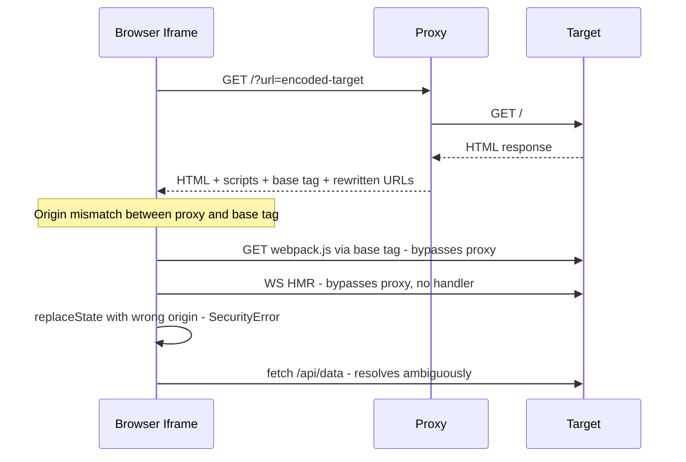
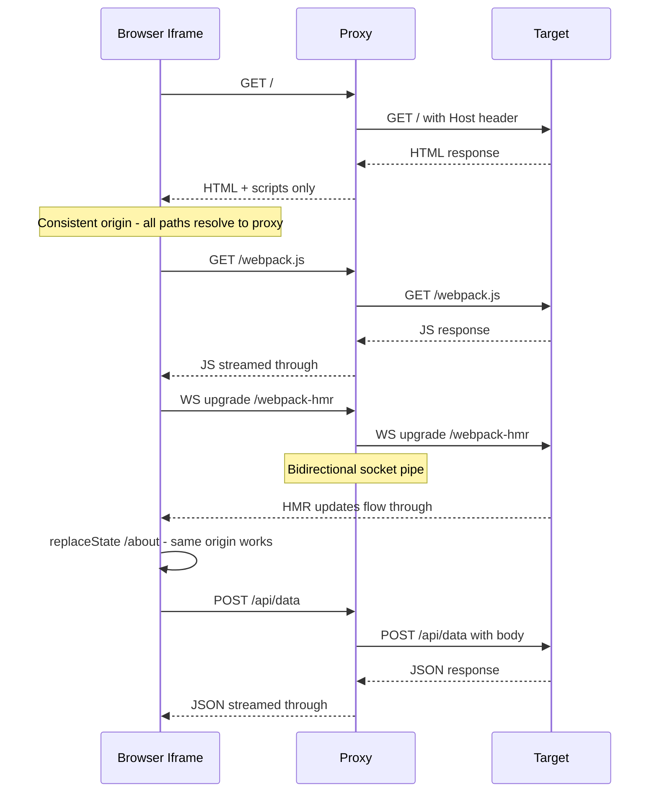
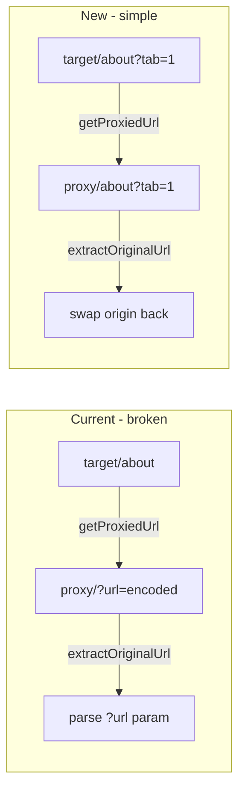
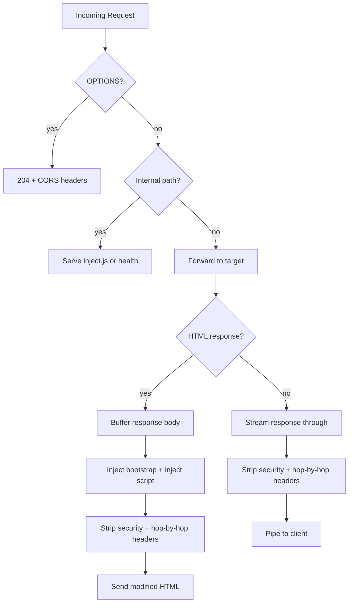
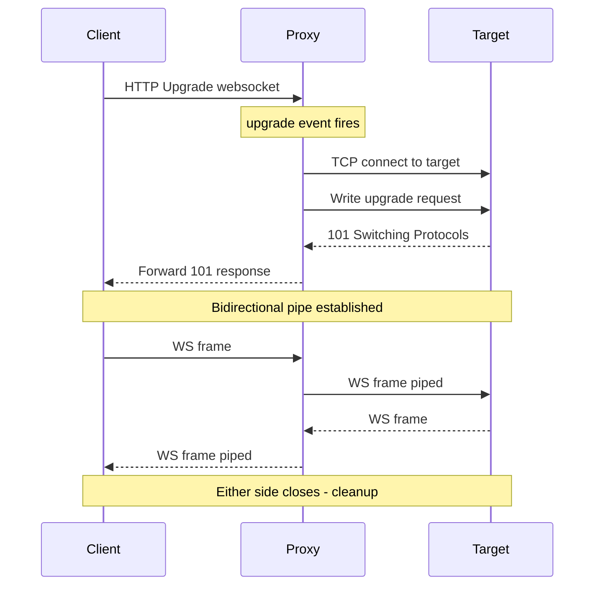
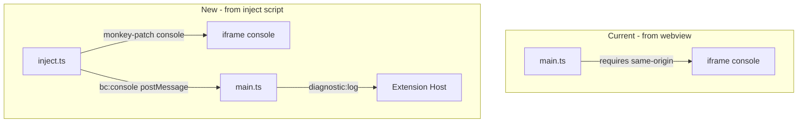
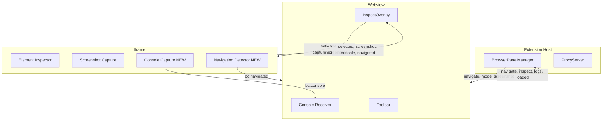

# Router-Safe Proxy Design for Web Lens

> Updated 2026-03-23: Added WebSocket/HMR support, console capture migration, SPA navigation detection, mermaid diagrams. Simplified cookie and service worker sections for dev-oriented scope.

## Goal

Fix Web Lens so modern SPA frameworks (Next.js, Vite, Vue, etc.) render correctly inside the embedded browser panel without relying on framework-specific history shims.

The immediate trigger is a confirmed Next.js App Router failure where the embedded page throws a `SecurityError` during `history.replaceState(...)`, plus `Parse Error: Data after Connection: close` from hop-by-hop header forwarding, and cross-origin `/_next/*` warnings.

The real solution is to preserve browser-like routing semantics while keeping Web Lens's existing instrumentation features:

- inspect overlay
- element capture
- console capture
- screenshots
- add-to-chat workflows
- **hot module reload (HMR) via WebSocket/EventSource**

## Problem Statement

Current Web Lens behavior serves the target app through a local reverse proxy whose top-level document URL is not browser-like.

Current example:

- original app URL: `http://localhost:3000/`
- current proxied document URL: `http://127.0.0.1:39195/?url=http://localhost:3000`

This creates three compatibility problems:

1. The runtime origin becomes the proxy origin instead of the app origin.
2. The current HTML rewrite logic injects a `<base>` tag pointing at the original origin, which encourages URL resolution to escape proxy space.
3. The proxy only handles HTTP GET and does not support WebSocket upgrades, request bodies, or hop-by-hop header stripping.

These behaviors together break SPA routers, HMR connections, form submissions, and API requests.

### Current Architecture (Broken)

## Design Principles

- Preserve browser-like root-relative routing semantics
- Keep all same-origin app navigation inside one proxy origin space
- Make URL mapping explicit and centralized
- Keep instrumentation separate from routing compatibility
- Prefer a single-origin app session model over framework-specific patches
- Support development workflows (HMR, API requests, form submissions) out of the box
- Keep a real-browser/CDP architecture as fallback, not the default

## Non-Goals

- Do not switch the primary architecture to a real-browser/CDP model yet
- Do not add Next-specific, React Router-specific, or Vue Router-specific history monkey-patches as the main fix
- Do not solve every iframe-hostile site limitation in this phase
- Do not remove or weaken Web Lens instrumentation features
- Do not implement full browser-equivalent cookie jar translation (dev servers on localhost rarely need this)
- Do not implement service worker interception (dev servers rarely use service workers)

## Recommended Approach

Replace the current query-based proxy URL model with a session-bound, root-mirroring proxy model.

Instead of:

- `http://127.0.0.1:<port>/?url=http://localhost:3000`

Use a proxy session whose root path mirrors the active upstream origin:

- upstream origin for this panel session: `http://localhost:3000`
- proxied document for `/`: `http://127.0.0.1:<port>/`
- proxied document for `/dashboard`: `http://127.0.0.1:<port>/dashboard`
- proxied asset for `/_next/static/...`: `http://127.0.0.1:<port>/_next/static/...`

### New Architecture

This preserves the core browser invariant that matters for SPA routers: root-relative history and navigation remain same-origin and root-based.

## Core Invariant

For a page loaded from the current upstream origin, the browser must observe these mappings:

- current app URL `http://localhost:3000/` -> browser document URL `http://127.0.0.1:<port>/`
- `history.replaceState({}, '', '/dashboard')` -> `http://127.0.0.1:<port>/dashboard`
- `history.pushState({}, '', 'settings')` from `/dashboard` -> `http://127.0.0.1:<port>/settings`
- `history.replaceState({}, '', '?tab=logs')` from `/dashboard` -> `http://127.0.0.1:<port>/dashboard?tab=logs`
- `history.replaceState({}, '', '#details')` from `/dashboard` -> `http://127.0.0.1:<port>/dashboard#details`

Those proxy-space URLs must then map back to the upstream paths:

- `/dashboard` -> upstream `/dashboard`
- `/settings` -> upstream `/settings`
- `/dashboard?tab=logs` -> upstream `/dashboard?tab=logs`

If the proxy model cannot preserve these invariants, it is not sufficient for broad SPA compatibility.

### URL Translation

## Architecture

### 1. Session-Bound Upstream Origin

Each open Web Lens panel owns one active upstream origin at a time.

Examples:

- `http://localhost:3000`
- `https://example.com`

Within that session:

- proxy root `/...` maps directly to the upstream origin path space
- same-origin app navigation stays in proxy root space
- the toolbar still shows original URLs to the user

If the page intentionally navigates to a different origin, Web Lens treats that as an origin switch:

- update the active upstream origin for that panel session
- reload the document through the proxy root for the new origin
- preserve the same root-mirroring invariant for the new origin

### 2. Central URL Mapper

Introduce one URL-mapping component owned by `ProxyServer`.

Responsibilities:

- convert browser proxy-space URLs into upstream URLs
- convert upstream URLs into browser-visible original URLs for the toolbar
- normalize redirect targets
- distinguish app paths from internal proxy endpoints

This mapper replaces scattered `?url=` assumptions.

### 3. Reserved Internal Namespace

Reserve an internal path prefix that cannot collide with app routes:

- `/__web_lens/inject.js`
- `/__web_lens/health`

Rules:

- internal endpoints must never be forwarded upstream
- app routes under the reserved prefix are unsupported unless explicitly namespaced another way
- internal URLs must not appear in user-visible toolbar history as app locations

### 4. Request Routing

### 5. Request Forwarding

The proxy forwards the full incoming request to the target:

- **Method**: Forward as-is (GET, POST, PUT, DELETE, PATCH, etc.)
- **Path + query**: Forward as-is (`req.url` maps directly to the target)
- **Headers**: Forward all client headers with these modifications:
  - `Host` is rewritten to the target's host
  - `Referer` is rewritten to the upstream URL equivalent
  - `Origin` is rewritten to the upstream origin for same-origin requests
  - `Accept-Encoding` is stripped so the upstream always sends uncompressed responses (required because the HTML path buffers and modifies the body; compressed bytes cannot be parsed as UTF-8)
  - Hop-by-hop headers are stripped per RFC 7230 (`connection`, `keep-alive`, `transfer-encoding`, `te`, `trailer`, `upgrade`, `proxy-authorization`, `proxy-authenticate`)
  - `Sec-Fetch-*` headers are dropped rather than forwarding misleading proxy-origin fetch metadata
- **Body**: For methods with a body (POST, PUT, PATCH), pipe `req` into the outgoing proxy request

### 6. Response Handling

- **HTML responses**: Buffer, inject instrumentation scripts, strip security and hop-by-hop headers, send
- **Non-HTML responses**: Stream through unchanged, strip security and hop-by-hop headers
- **Redirect responses**: Rewrite `Location` headers (see Redirect Semantics section)

### 7. WebSocket Upgrade Handling

The HTTP server listens for the `'upgrade'` event. On upgrade:

1. Open a TCP connection (`net.connect`) to the target host:port
2. Write the raw HTTP upgrade request (method, path, headers) to the target socket
3. Once the target responds with `101 Switching Protocols`, write that response back to the client socket
4. Pipe the two sockets bidirectionally (client <-> target)
5. Clean up on either socket closing or erroring

No WebSocket library is needed -- it's raw socket piping after the HTTP upgrade handshake. This supports HMR for Next.js (`/_next/webpack-hmr`), Vite (WebSocket on `/`), and any other dev server that uses WebSocket or HTTP upgrade.

### 8. HTML Injection Model (Simplified)

When serving HTML:

- inject instrumentation scripts (bootstrap inline script + external inject.js)
- **do not** inject a `<base>` tag pointing to the original upstream origin
- **do not** rewrite `href`, `src`, or `action` attributes (root mirroring handles this naturally)
- strip `Content-Security-Policy`, `Content-Security-Policy-Report-Only`, and `X-Frame-Options` headers
- strip `content-length` and `content-encoding` (since content is modified)

If the upstream HTML already contains a `<base>` tag:

- if it is same-origin relative to the current upstream origin, remove it (root mirroring provides correct behavior)
- if it is cross-origin, leave it unchanged

The `rewriteUrls()` method is deleted entirely.

**Known limitation -- absolute same-origin URLs:** If the upstream HTML contains absolute URLs with the target origin (e.g., `<a href="http://localhost:3000/about">`), these bypass the proxy. Root mirroring only handles relative and root-relative URLs. In practice this is rare: Next.js, Vite, and Vue CLI all generate root-relative paths in rendered HTML. If this becomes an issue, a targeted rewrite of absolute same-origin URLs to root-relative paths can be added to the HTML path.

**Nested iframe guard:** The proxy injects scripts into every HTML response, including same-origin iframes within the target app. The inject script must guard against double-initialization: if the script detects it is not in the top-level proxied frame (i.e., `window.parent` is not the VS Code webview), it should skip initialization to avoid duplicate console capture, navigation detection, and element inspection. The guard checks whether the script's direct parent is the webview host by testing for the `bc:setMode` message listener or a known sentinel.

### 9. Navigation Model

`BrowserPanelManager` keeps user-visible navigation state in original URLs, while the iframe loads proxy-space URLs.

Responsibilities:

- when the user enters `http://localhost:3000/dashboard`, initialize or switch the panel session to upstream origin `http://localhost:3000`
- load proxy URL `http://127.0.0.1:<port>/dashboard` into the iframe
- when the iframe reports its current proxy-space URL, translate it back to `http://localhost:3000/dashboard` for the toolbar
- if the iframe escapes proxy space or reports a malformed URL, show a clear error and log the failure

#### SPA Navigation Detection

For full-page navigations, the iframe `load` event fires and `main.ts` handles it (same as today).

For SPA navigations (pushState/replaceState), the inject script wraps the History API:

- The inject script wraps `history.pushState` and `history.replaceState` to post a `bc:navigated` message to the parent webview after each call
- The webview receives `bc:navigated` messages and forwards them to the extension host as navigation events
- `BrowserPanelManager` updates history and toolbar display

This combination covers both full-page and SPA navigations without requiring same-origin DOM access from the webview.

### 10. Console Capture Migration

Console capture moves from `main.ts` (webview) into `inject.ts` (runs inside the page):

- The inject script monkey-patches `console.log`/`warn`/`error` on load
- Captured entries are buffered (same 200 entry / ~50KB limits as current `console-capture.ts`)
- Entries are forwarded to the webview via `window.parent.postMessage({ type: 'bc:console', ... }, '*')`
- The webview receives `bc:console` messages and forwards them to the extension host as `diagnostic:log`
- The "Add Logs to Chat" flow: `main.ts` accumulates entries received via postMessage instead of reading from `consoleCapture.getEntries()`

This removes the dependency on same-origin `iframe.contentWindow.console` access.

### 11. Three-Layer Message Flow

### 12. Session Recovery

Because scheme, host, and port live in panel session state instead of the browser-visible URL, the extension must persist enough original navigation state to reconstruct the session.

Rules:

- persist the current original URL for each panel using webview state and extension-side panel state
- on panel restore or extension restart, reconstruct the active upstream origin from that original URL before reloading the iframe
- copied or shared proxy-origin URLs are intentionally not treated as stable/shareable URLs outside a live panel session
- all user-facing copy/share actions should use the original URL, not the proxy-space URL

## URL Grammar and Mapping Rules

The implementation must define a precise mapping grammar.

Required rules:

- preserve path, query, and fragment exactly when moving between proxy-space and upstream-space URLs
- normalize default ports when determining same-origin matches (`:80` for HTTP, `:443` for HTTPS)
- preserve trailing slash semantics
- distinguish same-origin upstream absolute URLs from cross-origin upstream absolute URLs
- reject malformed proxy URLs early with clear diagnostics

For this design, the browser-visible proxy URL does not encode scheme/host/port in the normal path for same-origin app navigation. Those values live in session state, not in every path segment.

## Redirect Semantics

Redirect handling is part of routing correctness.

The proxy must:

- rewrite absolute same-origin `Location` headers back into proxy root space
- resolve relative `Location` headers against the current upstream request URL, then map them into proxy root space
- treat cross-origin `Location` headers as origin-switch navigations
- preserve method semantics for `307` and `308`
- handle `301`, `302`, and `303` consistently with browser expectations
- log redirect loops and enforce a chain limit of 10

## Cookies

For the primary dev-oriented use case (proxying localhost dev servers), cookies are passed through unchanged. Dev servers on localhost rarely use complex cookie semantics (Domain, Secure, SameSite restrictions).

If cookie compatibility issues arise with specific setups, a per-panel-session cookie jar can be introduced as a future enhancement.

## Cross-Origin Request Policy

### Top-Level Navigations

- cross-origin top-level navigations become origin switches and start a new root-mirroring session for the new upstream origin

### Cross-Origin Subresources

- cross-origin images, fonts, scripts, stylesheets, and media should remain direct absolute URLs
- they are not folded into the current root-mirroring session

### Cross-Origin Script-Initiated Requests

- same-origin app requests travel through proxy space and are forwarded upstream
- cross-origin fetch/XHR from the page are not guaranteed to behave exactly like a real browser, because the browser-visible origin remains the proxy origin
- this limitation is logged and documented

## Error Handling

### Mapping Errors

If a request cannot be mapped between proxy-space and upstream-space:

- return a clear proxy error page
- log the proxy URL, intended upstream URL if known, and the reason

### Escape Errors

If the browser escapes proxy space unexpectedly:

- surface a diagnostic in the Web Lens output channel
- treat it as either an origin switch or a malformed navigation, based on the decoded target

### Internal Route Collisions

If an app path collides with the reserved internal namespace (`/__web_lens/`):

- fail clearly and log the collision
- do not silently forward internal endpoints upstream

## Explicitly Out of Scope for This Phase

- full browser-equivalent cross-origin fetch/XHR semantics for arbitrary third-party APIs
- service worker support (dev servers rarely use service workers; if encountered, let registration fail naturally)
- full browser-equivalent cookie jar translation
- EventSource (SSE) does not require special handling: `text/event-stream` responses are not `text/html`, so they flow through the non-HTML streaming pipe path naturally. Next.js HMR (`/_next/webpack-hmr`) uses SSE and works without additional support.

## Impact on Existing Components

### Files Modified

| File | Changes |
|------|---------|
| `src/proxy/ProxyServer.ts` | Rewrite request routing (path-based instead of `?url=`), add body forwarding for all HTTP methods, add WebSocket upgrade handler, delete `rewriteUrls()`, simplify bootstrap script (remove history monkey-patch), constructor takes target origin |
| `src/webview/inject.ts` | Add console capture (monkey-patch console.log/warn/error), add SPA navigation detection (wrap pushState/replaceState with `bc:navigated` notification), add nested iframe guard to skip initialization in non-top-level frames |
| `src/webview/main.ts` | Remove direct `iframe.contentWindow.console` monkey-patching, add `bc:console` and `bc:navigated` message listeners, simplify `extractOriginalUrl()` to origin-swap, remove `canInject` logic |
| `src/panel/BrowserPanelManager.ts` | Pass target origin to ProxyServer, update `getProxiedUrl` call sites |
| `src/proxy/ProxyServer.test.ts` | Update tests for new proxy behavior (no URL rewriting, path-based routing) |

### Files Unchanged

| File | Why |
|------|-----|
| `src/webview/inspect-overlay.ts` | Message relay logic unchanged |
| `src/webview/toolbar.ts` | Toolbar UI unchanged |
| `src/context/ContextExtractor.ts` | Context bundling unchanged |
| All adapter files | Delivery pipeline unchanged |
| `src/extension.ts` | Extension activation unchanged |
| `esbuild.config.js` | Build setup unchanged |

### Files with Code Removed

- `src/webview/console-capture.ts` -- capture logic moves to inject.ts. The file becomes a thin message receiver: it listens for `bc:console` postMessages, buffers entries, and exposes `getEntries()` for the "Add Logs to Chat" flow. The monkey-patching logic is deleted from this file.

## Testing Strategy

### Unit Tests

- proxy-session URL mapping for root, nested paths, query strings, and fragments
- default-port normalization
- malformed proxy URL rejection
- redirect target rewriting
- WebSocket upgrade forwarding
- hop-by-hop header stripping
- `Accept-Encoding` stripped from outgoing requests (ensures uncompressed HTML for injection)
- HTML injection without URL rewriting or base tag
- console capture message forwarding
- nested iframe guard (inject script skips init in non-top-level frames)

### Regression Tests

- exact regression test for the confirmed Next.js `replaceState` failure
- root-relative `replaceState('/dashboard')`
- relative `pushState('settings')`
- query-only `replaceState('?tab=logs')`
- hash-only `replaceState('#details')`
- redirect back into proxy root space
- POST request forwarding with body
- WebSocket upgrade and bidirectional data flow

### Manual Verification

Verify against:

- one Next.js App Router app
- one Vite-based SPA (React or Vue)
- one basic multi-page site

Validation should include:

- initial page render
- client-side navigation
- HMR / hot reload working
- API requests (fetch/XHR) working
- toolbar URL correctness
- refresh on an internal route
- console/inspection still working

## Alternatives Considered

### 1. Query-Based Proxy with History Shim

Patch `history.pushState` and `history.replaceState` in the bootstrap script.

Rejected as the primary fix because:

- it treats symptoms instead of browser URL semantics
- it is framework-fragile
- it is likely to miss related navigation APIs and edge cases

### 2. Nested Path Proxy (`/http/host/...`)

Rejected because it does not preserve root-relative history behavior.

From a proxied document like `http://127.0.0.1:<port>/http/localhost:3000/`, a router call such as `history.replaceState({}, '', '/dashboard')` would resolve to `http://127.0.0.1:<port>/dashboard`, not to the intended nested path.

### 3. Real Browser / CDP Architecture

Drive a real browser instance and mirror it into VS Code, similar to `browser-preview`.

Not chosen as primary now because:

- significantly more complexity
- heavier runtime footprint
- broader implementation and maintenance surface

Kept as fallback because:

- highest rendering fidelity
- strongest long-term answer for hostile or complex sites if proxy-based embedding still proves insufficient

### 4. Dev Server Middleware (No Proxy)

Provide a small npm package users add to their dev server config to inject WebLens scripts.

Rejected because:

- requires per-project setup
- not zero-config
- breaks the "just works" experience

## Expected Outcome

After implementation, Web Lens should:

- render SPA routes with browser-like history behavior
- keep same-origin app navigation inside one proxy origin space
- preserve inspect/log/screenshot features
- support HMR/hot reload for Next.js, Vite, and other dev servers using WebSocket
- support API requests and form submissions through the proxy
- reduce the need for framework-specific compatibility shims
- keep a real-browser/CDP architecture available as fallback if remaining embed limitations prove too costly

Success for this phase is defined as same-origin SPA routing correctness for the active upstream origin with working HMR and API requests; remaining unsupported browser-parity gaps should be explicit and fall back to the CDP path if needed.
